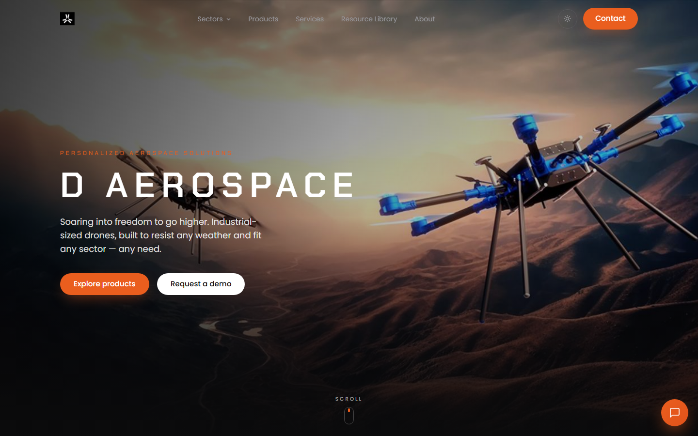
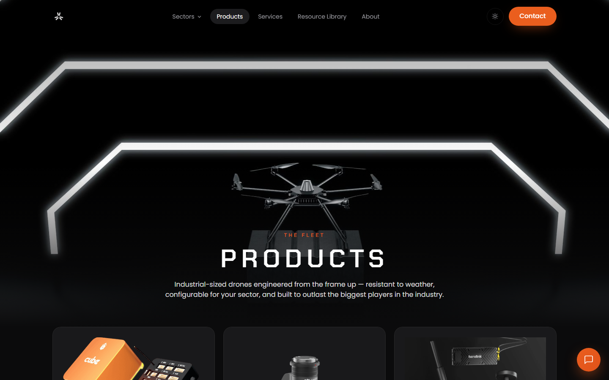
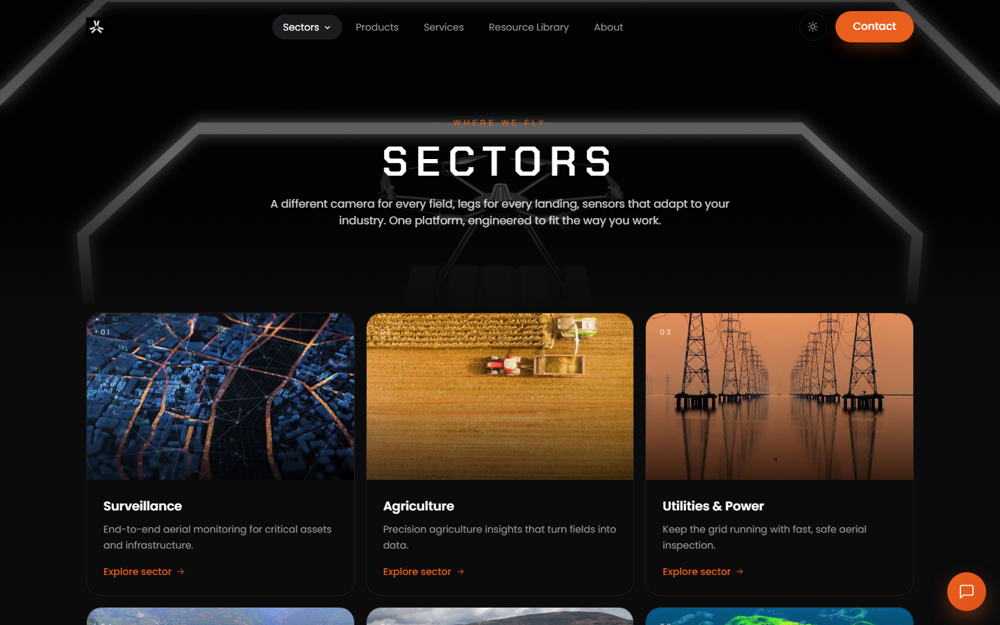
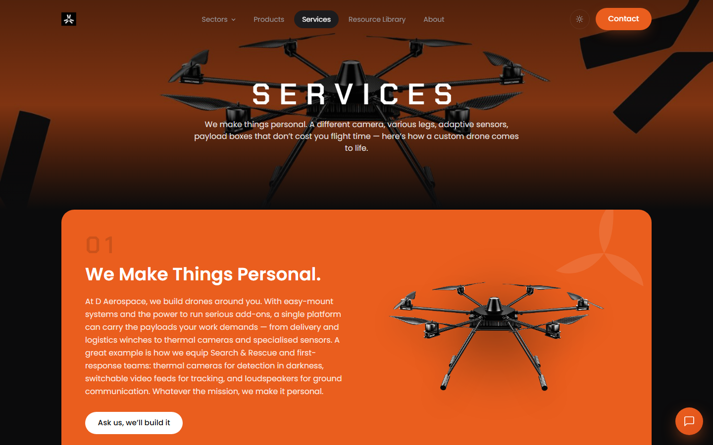
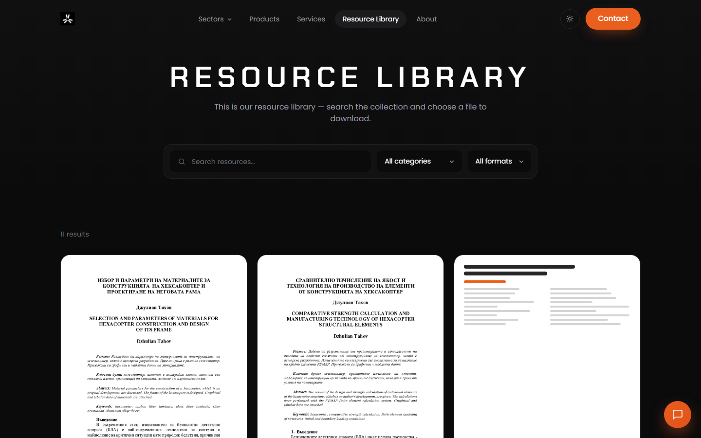

<p align="center">
  
</p>

<h1 align="center">D Aerospace — Official Website</h1>

<p align="center">
  <em>Personalized Aerospace Solutions — soaring into freedom to go higher.</em><br/>
  <a href="https://d-aerospace-d71be.web.app">Live site</a> ·
  <a href="docs/DEVELOPMENT.md">Development</a> ·
  <a href="docs/DEPLOYMENT.md">Deployment</a> ·
  <a href="docs/CONTENT-GUIDE.md">Content guide</a> ·
  <a href="docs/DESIGN-SYSTEM.md">Design system</a>
</p>

---

This repository contains the source of the official D Aerospace website — the home of our
industrial UAV fleet (**Salvatore**, **Azriel**, **Lifter**), our sector solutions, our
engineering services and the **IRIS C2 Mission Control** platform.



## Tech stack

| | |
|---|---|
| Framework | SvelteKit 2 (Svelte 5) |
| Styling | Tailwind CSS v4 — design tokens in `src/app.css` |
| Output | Fully prerendered static site (`adapter-static`) |
| Hosting | Firebase Hosting |
| Fonts | Chakra Petch + Poppins, self-hosted (no external requests) |

Highlights: light/dark theme with persisted preference, scroll-reveal motion system,
9 prerendered sector pages, 5 service process pages, searchable Resource Library with our
published research papers, and zero-JS-required content (everything is server-rendered
HTML first).

## Quick start

```bash
npm install
npm run dev        # local dev server → http://localhost:5173
```

```bash
npm run build      # production build → build/
npm run preview    # inspect the production build locally
```

Full instructions, including our team's environment notes: [docs/DEVELOPMENT.md](docs/DEVELOPMENT.md).

## Deploying

The site ships to Firebase Hosting (project `d-aerospace-d71be`):

```bash
npm run build
firebase deploy --only hosting
```

Step-by-step deployment and the **d-aerospace.com domain cut-over checklist**:
[docs/DEPLOYMENT.md](docs/DEPLOYMENT.md).

## Editing content

All copy — product specs, sector pages, service steps, FAQs, papers, contact details —
lives in **one file**: [`src/lib/data/site.js`](src/lib/data/site.js). Edit there; every
page updates. See [docs/CONTENT-GUIDE.md](docs/CONTENT-GUIDE.md) for the field-by-field
reference our team uses.

## Screenshots

| Home | Products |
|---|---|
|  |  |

| Sectors | Sector detail |
|---|---|
|  |  |

| Services | Resource Library |
|---|---|
|  |  |

---

© D Aerospace. All rights reserved. This code and its assets are proprietary to
D Aerospace and are not licensed for reuse without written permission.
